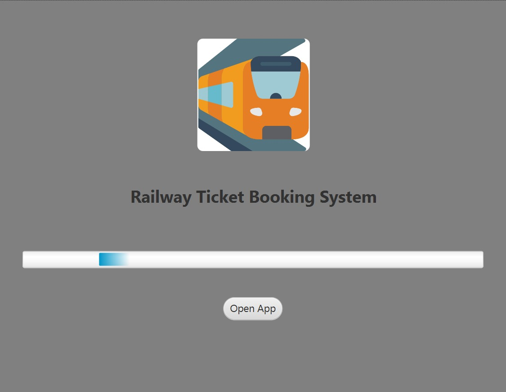
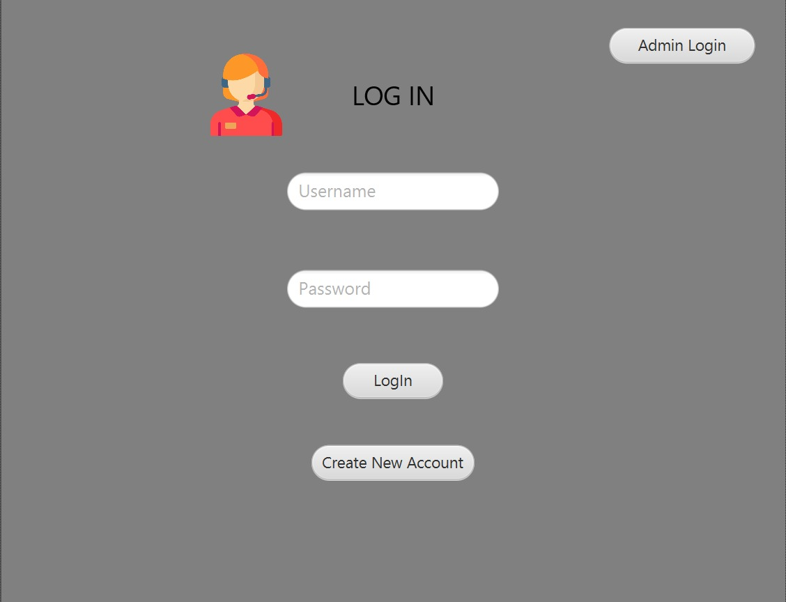
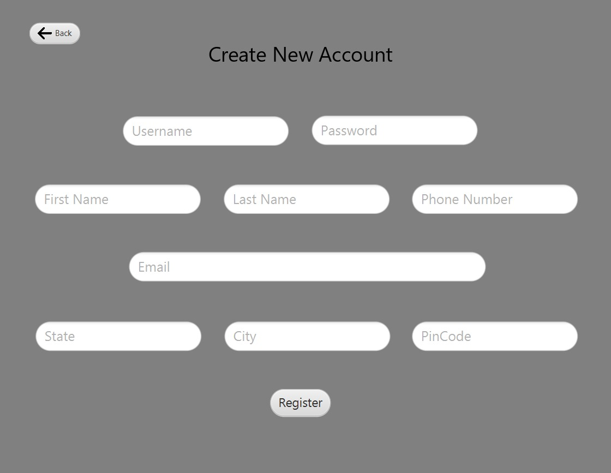
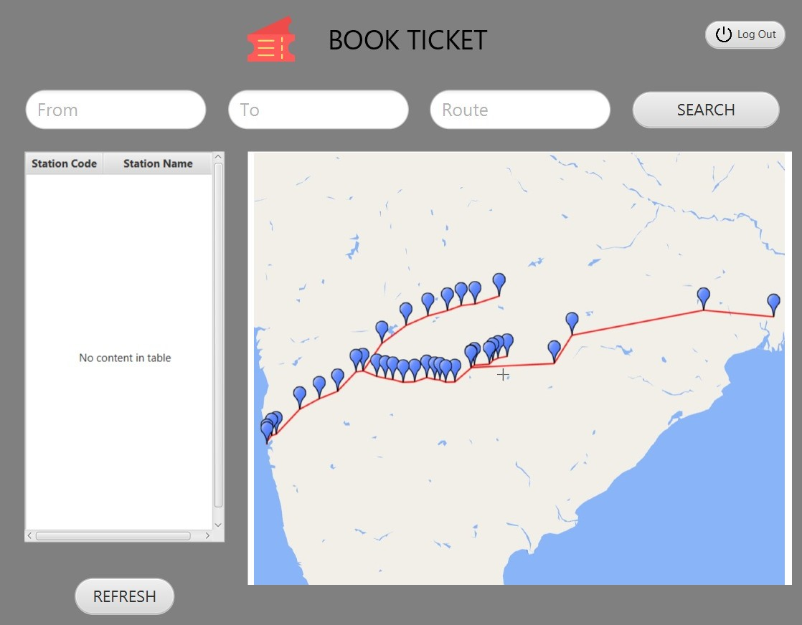
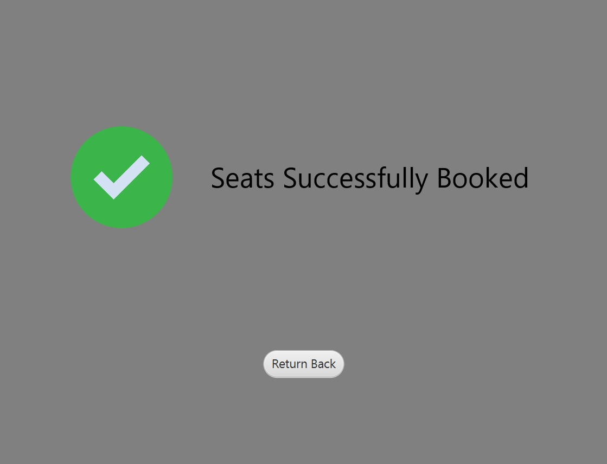

# Railway-Ticket-Booking-System-JavaFx

## Introduction

Welcome to Railway-Ticket-Booking-System-JavaFx, a JavaFx-based application that allows users to login, create accounts, and book railway tickets. The system consists of two dashboards, one for regular users and another for administrators. Users can select source and destination stations, view a map to visualize stations and routes, add passenger information, and book tickets. The seat count will decrement upon successful ticket booking. Administrators have access to user details, the ability to remove users from the application, add new stations, manage seat availability, and handle passenger information.

## Installation

To run the Railway-Ticket-Booking-System-JavaFx, follow these steps:

1. Install Java: Ensure that you have Java Development Kit (JDK) installed on your system.

2. Clone the Repository: Clone this repository to your local machine using Git or download the ZIP archive and extract it.

3. Build the Application: Using a Java IDE or the command line, build the application from the source code.

4. Run the Application: Execute the compiled JavaFX application to launch the Railway-Ticket-Booking-System.

## Screenshots

|  |  |  |
|--------------|--------------|--------------|
|  |  |  |

|  |  |
|--------------|--------------|
|  |  |

## Features

- User Authentication: Users can create accounts and login securely.
- Station Selection: Users can choose source and destination stations.
- Station Map: A map is provided to visualize available stations and their routes.
- Passenger Information: Users can add passenger names while booking tickets.
- Seat Booking: Users can book tickets, and the seat count will be updated accordingly.
- Administrator Dashboard: Administrators have access to a separate dashboard.
- User Management: Admins can view user details and remove users from the application.
- Station Management: Admins can add new stations and manage seat availability.
- Passenger Management: Admins can add or remove passengers from the system.

## Usage

1. Launch the Application: Run the compiled JavaFX application to open the Railway-Ticket-Booking-System.

2. User Registration/Login: Users can create a new account or log in using existing credentials.

3. User Dashboard: Users can select source and destination stations, view the map, add passenger information, and book tickets.

4. Admin Dashboard: Administrators have access to additional functionalities for user and station management.

## Contributions

Contributions to the Railway-Ticket-Booking-System-JavaFx project are welcome! If you find any issues or have ideas for improvements, feel free to submit a pull request. Please adhere to the project's coding standards and documentation guidelines.

## Contact

If you have any questions or need further assistance, please contact at aniketvparate@email.com.

Thank you for using Railway-Ticket-Booking-System-JavaFx! Happy booking!